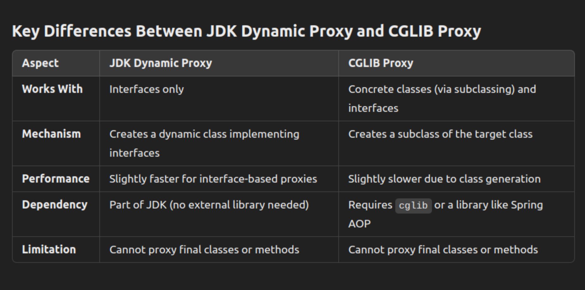

What are proxies ? 
- proxies are substitutes for any target class.
- We may need to enforce access control on certain objects, or perform tasks like pre & post tasks logging, rolling transactions back etc.
- In such cases, proxy classes can help us.

### Types of proxies

#### JDK Dynamic Proxy (Java Example):
- JDK Dynamic Proxy is used when you want to create a proxy for interfaces. 
- The proxy class implements the same interface and delegates method calls to a handler (typically an instance of InvocationHandler).
- Refer package : dynamicjdk

Notes:
- Internal working:
  - The Proxy.newProxyInstance() method creates a proxy instance at runtime that implements the specified interfaces (ISubject in this case).
  - this proxy instance is a dynamically generated class that does not extend the target class (Math), it implements the interfaces.
- Casting it to a concrete class will throw a class cast exception.

#### Cglib proxy:
- CGLIB (Code Generation Library) is used to create proxies for concrete classes (i.e., classes that do not implement interfaces).
- It creates a subclass of the target class and overrides methods to intercept calls.
- requires external dependency : 
  - ```gradle 
    implementation 'cglib:cglib:3.3.0'
    ```
### Summary

